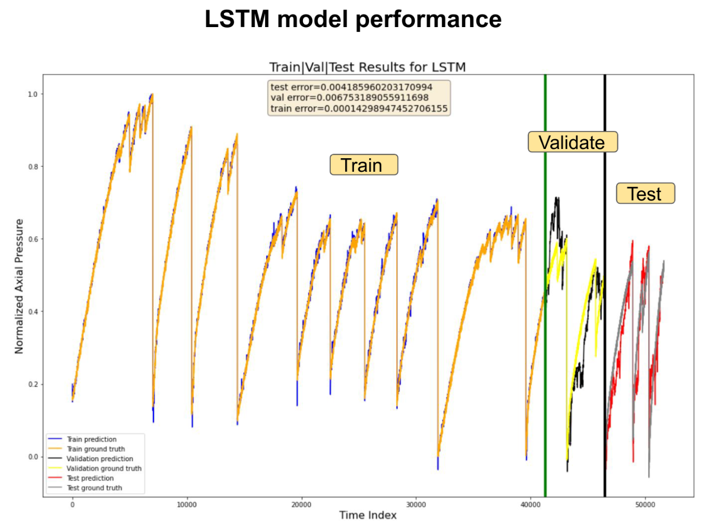
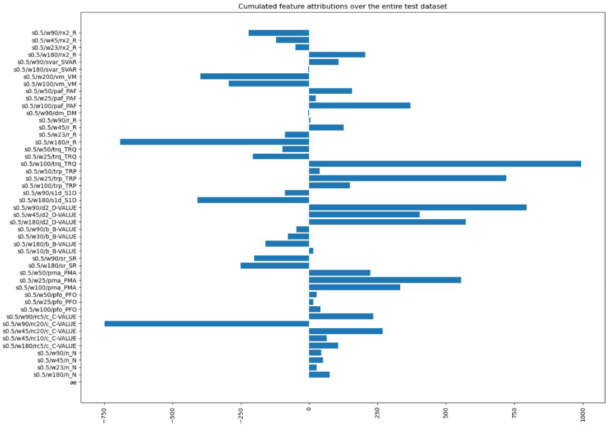

# seismologic_pressure_prediction_with_explainability

## This repository contains the final cleaned version of the seismology code that aims at predicting pressure using physically explainable features.
## Explainable AI techniques such as "Integrated Gradients" are used to shed more light on the developed black-box neural network model.

## This work was presented at the European Geosciences Union 2023 (EGU23): https://meetingorganizer.copernicus.org/EGU23/EGU23-1967.html | https://doi.org/10.5194/egusphere-egu23-1967 

## For explanations, please find the EGU23 presentation in this repository, file: "EGU2023_presentation.pdf"

# **Many thanks to the following institutions that made this work possible:**
## **German Climate Computing Center (DKRZ), Hamburg, Germany**
## **GFZ-Potsdam**
## **Helmholtz Center Hereon, Geesthacht, Germany**
## **Helmholtz AI**
## **This work was supported by Helmholtz Association's Initiative and Networking Fund through Helmholtz AI [grant number: ZT-I-PF-5-01].**
## **This work used resources of the Deutsches Klimarechenzentrum (DKRZ) granted by its Scientific Steering Committee (WLA) under project ID AIM.**

### Before proceeding with the code execution, please create an appropriate environment with the necessary dependencies. Personally, I used 2 environments for the development and running of experiments, so if some of the scripts result in errors, please consider checking the other environment. For information, I describe both environments separately via: "laptop_requirements.txt" and "server_requirements.txt", respectively. Please note that these files list third party libraries and dependancies that I use in other projects I work on and that may be therefore irrelevant for this repository in particular.

### The raw data preprocessing scripts are located inside "src/preprocessing". They should be executed in the following order and result in the following outputs:
#### 1) process_wgrn04_data.py -> outputs cloudcontainer/wgrn04_features.hdf5
#### 2) process_wgrn05_data.py -> outputs cloudcontainer/wgrn05_features.hdf5
#### 3) process_wgrn07_data.py -> outputs cloudcontainer/wgrn07_features.hdf5
#### 4) experiment4_merge_with_pressure_table.py -> outputs cloudcontainer/wgrn04_features_and_pressure.hdf5
#### 5) experiment5_merge_with_pressure_table.py -> outputs cloudcontainer/wgrn05_features_and_pressure.hdf5
#### 6) experiment7_merge_with_pressure_table.py -> outputs cloudcontainer/wgrn07_features_and_pressure.hdf5
#### 7) experiment4_merge_pressure_and_ae.py -> outputs cloudcontainer/wgrn04_ae_features_and_pressure.hdf5
#### 8) experiment5_merge_pressure_and_ae.py -> outputs cloudcontainer/wgrn05_ae_features_and_pressure.hdf5
#### 9) experiment7_merge_pressure_and_ae.py -> outputs cloudcontainer/wgrn07_ae_features_and_pressure.hdf5
#### 10) concatenate_data_from_all_3_experiments.py -> outputs cloudcontainer/concatenated_experiments.hdf5

### Available Jupyter notebooks inside the "src/jupyter_code" folder and their functionality:
#### 1) visualize_data_splits.ipynb is used to check if the preprocessing of the data done with the above-mentioned scripts looks reasonable and correct.
#### 2) compute_dataset_derivative_spikes.ipynb is used to compute the time indices of the pressure derivative spikes. This is useful if we want to apply explainable techniques at specific target indices and the most interesting indices for us is where the pressure drops.
#### 3) baseline_linear_regression_notebook.ipynb contains the training of a linear regression baseline model.
#### 4) baseline_polynomial_features_linear_regression_notebook.ipynb employs a linear regression model with higher degree features.
#### 5) baseline_random_forest_regression_notebook.ipynb contains the training of a random forest regressive baseline model.
#### 6) LSTM_train_notebook.ipynb contains the training of our deep learning LSTM seismology prediction model.
#### 7) LSTM_test_notebook.ipynb contains the testing of the trained model that performed best on the validation set. In the first part of the script, the model is applied on the unseen test dataset, and in the second part of the script explainable AI tools and techniques are used to gain insights into the model.

### The "src/nonjupyter_code" folder contains:
#### 1) seismology_model_train.py if you want to train the model without using the LSTM_train_notebook.ipynb mentioned earlier. Demo example of how to run this script:
#### python seismology_model_train.py --n-units 64 --lr 0.9 --n-train-steps 100 --batch-size 1 --lbfgs-iterations 10
#### 2) explain_lstm_globally.py to compute the cumulated feature importance attributions over the entire test dataset.